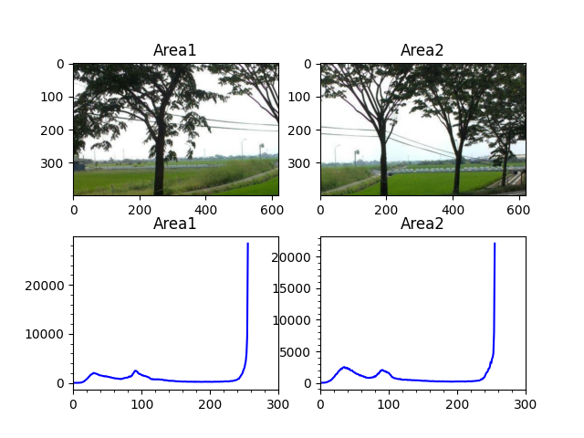
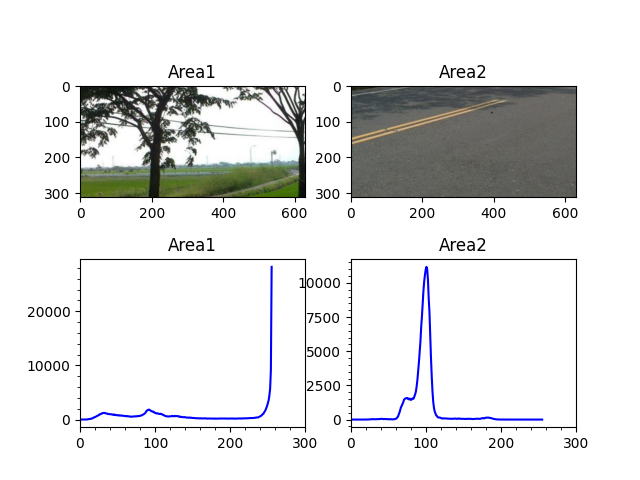

# HW2

撰寫一個程式
框出圖片內的某兩個部份
並判斷其是否相像

## 測試圖片


## 選取兩個看起來不一樣的區域
測試結果


> 比對結果，相關性越高、巴氏距離越低，兩張圖片越相似
> - 相關性：  0.11231397635367635
> - 巴氏距離： 0.6292342137089971

## 選取兩個看起來相似的區域
測試結果



> 比對結果，相關性越高、巴氏距離越低，兩張圖片越相似
> - 相關性：  0.9917894385412611
> - 巴氏距離： 0.0861190436691372

## Code

```python
# HW2.py
import cv2
import matplotlib.pyplot as plt

global img
global point1, point2, cut_img1, cut_img2

# 滑鼠左右鍵，分別選擇兩個不同的區域，並將兩個區域命名為Area1, Area2存檔
def on_mouse(event, x, y, flags, param):
    global img, point1, point2, cut_img1, cut_img2
    img2 = img.copy()

    if event == cv2.EVENT_LBUTTONDOWN:  # 左键点击
        point1 = (x, y)
        cv2.circle(img2, point1, 10, (0, 255, 0), 5)
        cv2.imshow('image', img2)
    elif event == cv2.EVENT_MOUSEMOVE and (flags & cv2.EVENT_FLAG_LBUTTON):  # 按住左键拖曳
        cv2.rectangle(img2, point1, (x, y), (255, 0, 0), 5)
        cv2.imshow('image', img2)
    elif event == cv2.EVENT_LBUTTONUP:  # 左键释放
        point2 = (x, y)
        cv2.rectangle(img2, point1, point2, (0, 0, 255), 5)
        cv2.imshow('image', img2)
        min_x = min(point1[0], point2[0])
        min_y = min(point1[1], point2[1])
        width = abs(point1[0] - point2[0])
        height = abs(point1[1] - point2[1])
        cut_img1 = img[min_y:min_y + height, min_x:min_x + width]
        cv2.imwrite('Area1.jpg', cut_img1)

    if event == cv2.EVENT_RBUTTONDOWN:  # 左键点击
        point1 = (x, y)
        cv2.circle(img2, point1, 10, (0, 255, 0), 5)
        cv2.imshow('image', img2)
    elif event == cv2.EVENT_MOUSEMOVE and (flags & cv2.EVENT_FLAG_RBUTTON):  # 按住左键拖曳
        cv2.rectangle(img2, point1, (x, y), (255, 0, 0), 5)
        cv2.imshow('image', img2)
    elif event == cv2.EVENT_RBUTTONUP:  # 左键释放
        point2 = (x, y)
        cv2.rectangle(img2, point1, point2, (0, 0, 255), 5)
        cv2.imshow('image', img2)
        min_x = min(point1[0], point2[0])
        min_y = min(point1[1], point2[1])
        width = abs(point1[0] - point2[0])
        height = abs(point1[1] - point2[1])
        cut_img2 = img[min_y:min_y + height, min_x:min_x + width]
        cv2.imwrite('Area2.jpg', cut_img2)


def main():
    global img
    img = cv2.imread('road.jpg')
    # img = cv2.cvtColor(img, cv2.COLOR_BGR2GRAY)
    cv2.namedWindow('image')
    cv2.setMouseCallback('image', on_mouse)
    cv2.imshow('image', img)
    cv2.waitKey(0)

    newImg1 = cv2.resize(cut_img1, (cut_img2.shape[1], cut_img2.shape[0]))

    # 灰階
    gray1 = cv2.cvtColor(newImg1, cv2.COLOR_BGR2GRAY)
    gray2 = cv2.cvtColor(cut_img2, cv2.COLOR_BGR2GRAY)

    # 直方圖
    H1 = cv2.calcHist([gray1], [0], None, [256], [0, 256])
    H2 = cv2.calcHist([gray2], [0], None, [256], [0, 256])
    # print(H1)

    # 正規化
    H1 = cv2.normalize(H1, H1, 0, 100, cv2.NORM_MINMAX, -1)
    H2 = cv2.normalize(H2, H2, 0, 100, cv2.NORM_MINMAX, -1)

    # 畫圖
    fig, ax = plt.subplots(2, 2)

    ax[0, 0].set_title('Area1')
    ax[0, 0].imshow(cv2.cvtColor(newImg1, cv2.COLOR_BGR2RGB))

    ax[0, 1].set_title('Area2')
    ax[0, 1].imshow(cv2.cvtColor(cut_img2, cv2.COLOR_BGR2RGB))

    ax[1, 0].set_title('Area1')
    ax[1, 0].plot(H1, color='b')
    ax[1, 0].minorticks_on()
    ax[1, 0].set_xlim([0, 300])
    ax[1, 0].set_ylabel("percentage")

    ax[1, 1].set_title('Area2')
    ax[1, 1].plot(H2, color='b')
    ax[1, 1].minorticks_on()
    ax[1, 1].set_xlim([0, 300])
    # ax[1, 1].set_ylabel("percentage")

    plt.show()

    # 比較
    compare1 = cv2.compareHist(H1, H2, cv2.HISTCMP_CORREL)
    compare2 = cv2.compareHist(H1, H2, cv2.HISTCMP_BHATTACHARYYA)

    print("比對結果，相關性越高、巴氏距離越低，兩張圖片越相似")
    print("相關性： ", compare1)
    print("巴氏距離：", compare2)


if __name__ == '__main__':
    main()

```