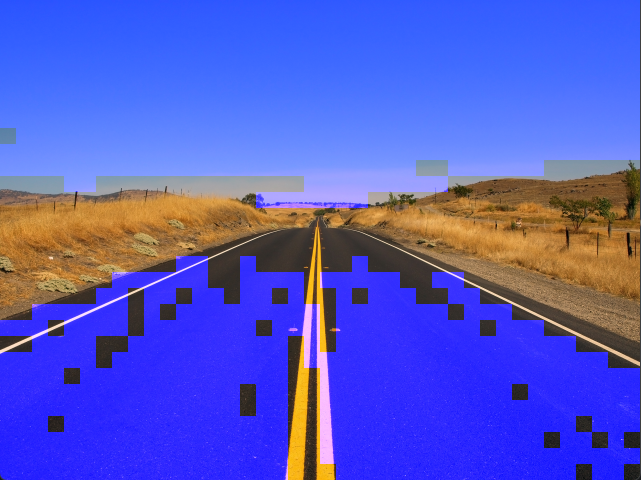
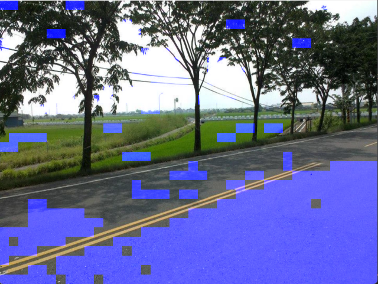
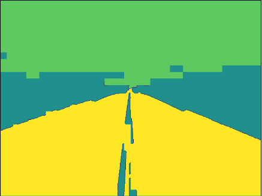
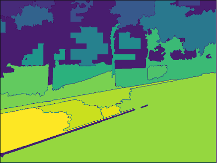

# HW3

## 測試環境
- Win11
- CPU: i7-12700H
- python 3.10.x
    - opencv 4.5.5.64
    - numpy 1.24.2
    - matplotlib 3.7.1

## LBP抓馬路區域

1. 將圖片切割成數個區塊
2. 計算所有區塊的histogram
3. 在畫面最下面選出一個區塊做基準
4. 透過BFS走訪整張圖片，前一個區塊與後一個區塊比較，若兩者相似，將後一個區塊記錄起來，並把基準換做後一個區塊，待後續比較使用
5. 最後將記錄好的結果還原成圖片

## 將lbp當作watershed的marker
1. 將BFS走訪後記錄好的結果，當作marker，繪製圖片watershed的結果

